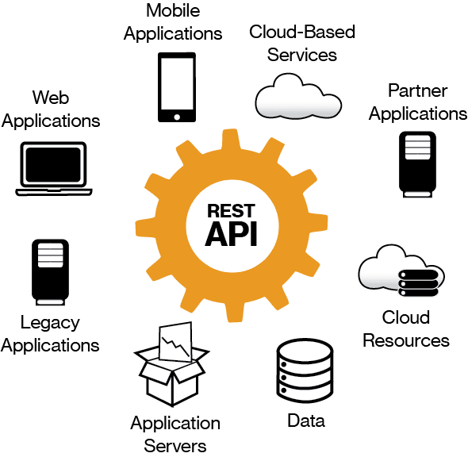

## Введение в API: Что это такое и зачем он нужен?

### Что такое API?

**API (Application Programming Interface)** — это набор правил и протоколов, который позволяет различным программным приложениям взаимодействовать друг с другом. Он определяет методы, с помощью которых одна программа может запрашивать данные или услуги у другой. API служит своего рода «мостом» между различными системами, позволяя им обмениваться информацией и функциональностью.

### Зачем нужен API?

**API** играет ключевую роль в современном программировании и разработке приложений. Вот несколько основных причин, почему он так важен:

- `Интеграция`: API позволяет различным системам и приложениям работать вместе. Например, веб-приложение может использовать API для интеграции с платежной системой, чтобы обрабатывать транзакции.

- `Повторное использование кода`: Разработчики могут использовать готовые API для выполнения общих задач, таких как аутентификация пользователей или работа с базами данных, что значительно ускоряет процесс разработки.

- `Масштабируемость`: API позволяет легко добавлять новые функции и расширять функциональность приложения без необходимости переписывать весь код.

- `Безопасность`: API может обеспечить уровень абстракции, который скрывает внутренние детали реализации системы, обеспечивая безопасность и контроль доступа.

- `Упрощение взаимодействия`: API упрощает взаимодействие между различными компонентами системы, что особенно важно в распределенных архитектурах и микросервисах.

### Типы API

Существует несколько типов API, каждый из которых имеет свои особенности и области применения:

- `Веб-API`: Это наиболее распространенный тип API, который позволяет приложениям взаимодействовать через интернет с использованием протоколов HTTP/HTTPS. Примеры включают RESTful и SOAP API.

- `Библиотеки и фреймворки`: Эти API предоставляют разработчикам доступ к функциям и методам, которые можно использовать в своих приложениях. Например, библиотеки для работы с графикой или математическими вычислениями.

- `Операционные системы`: API операционных систем позволяют приложениям взаимодействовать с аппаратным обеспечением и системными ресурсами. Например, Windows API предоставляет функции для работы с окнами, файлами и устройствами.

- `Аппаратные API`: Эти интерфейсы позволяют программам взаимодействовать с аппаратными компонентами, такими как датчики или камеры.

### Примеры использования API 

- `Социальные сети`: Многие социальные сети, такие как Facebook и Twitter, предоставляют API, которые позволяют разработчикам интегрировать функции этих платформ в свои приложения, например, для публикации постов или получения данных о пользователях.

- `Картографические сервисы`: Google Maps API позволяет разработчикам встраивать карты и навигационные функции в свои веб-сайты и мобильные приложения.

- `Платежные системы`: Платежные API, такие как Stripe или PayPal, позволяют разработчикам обрабатывать платежи и управлять транзакциями без необходимости создания собственной платежной инфраструктуры.

### Заключение

>API — это мощный инструмент, который значительно упрощает разработку программного обеспечения и интеграцию различных систем. Он позволяет разработчикам сосредоточиться на создании уникальных функций и улучшении пользовательского опыта, вместо того чтобы тратить время на создание базовых компонентов с нуля. В условиях быстро меняющегося технологического ландшафта понимание и использование API становится необходимым навыком для современных разработчиков.